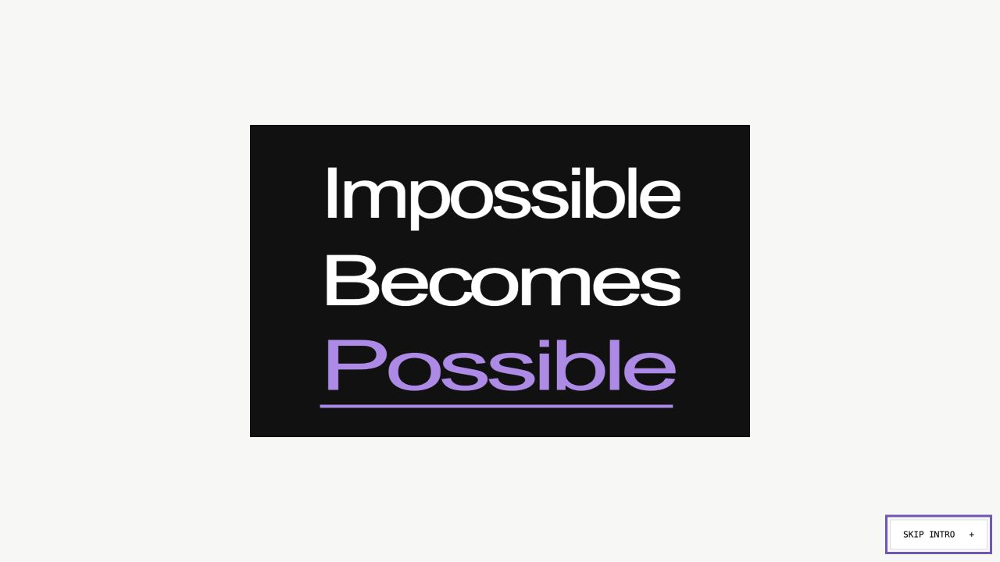

# Intro and resource pages

Based on main `881a7b6`. The existing homepage content and photo animation, About page content, Join form and social destinations are preserved.

## Implementation

- Fixed-size three-band opening card, purple underline, vertical Admission / Possible convergence and fade into the current homepage.
- Intro runs on the first homepage visit in a tab session. Deep links and reduced-motion visits bypass it. Skip, Escape, focus restoration and a 6.5-second fail-safe prevent a blocked page.
- Thirteen static Product and Resources pages, generated by `scripts/pages.mjs`, share existing navigation and branding. Content includes planning checklists, essay exercises, official application/aid links, existing FAQs and a contact email preparation form.
- Relative URLs support both GitHub Pages' repository subpath and root hosting. Generated HTML is committed, so the current Pages upload workflow requires no change.

## Verification

- Static build (`node scripts/pages.mjs`) passed; 13 pages generated.
- JavaScript syntax checks passed for all public scripts and build/check scripts.
- `node scripts/check-pages.mjs`: 16 pages, 672 local links/assets; file existence, fragment targets, one H1 and repository-subpath resolution passed.
- `node scripts/check-intro.mjs`: session replay, reduced motion, deep links, skip, Escape, animation completion, timeout, preference change and unavailable storage passed using an isolated DOM lifecycle harness.
- Rendered desktop guide pages and intro phases inspected. Resources menu navigation to FAQ and FAQ expansion verified in browser. Contact preparation tested with synthetic input; it generated a correctly encoded mailto draft without sending anything.
- Narrow layout was observed during browser testing. **Exact requested desktop/tablet/mobile dimensions remain unverified:** the in-app browser viewport override returned inconsistent dimensions and sometimes cropped instead of resizing. Chrome was unavailable. Do not treat these screenshots as proof of exact breakpoint coverage.
- Browser-level reduced-motion emulation was unavailable; the reduced-motion bypass is covered by the lifecycle harness and CSS inspection.

## Review before merge

Check the new pages at 1440×900, 768×1024 and 390×844 in a browser with reliable responsive emulation. Confirm the intro at about 2 seconds (three bands), 3.5 seconds (Admission / Possible), then the existing homepage at 5.1 seconds. Test Skip and a same-tab reload. The PR is intentionally draft until this remaining visual verification is complete.

